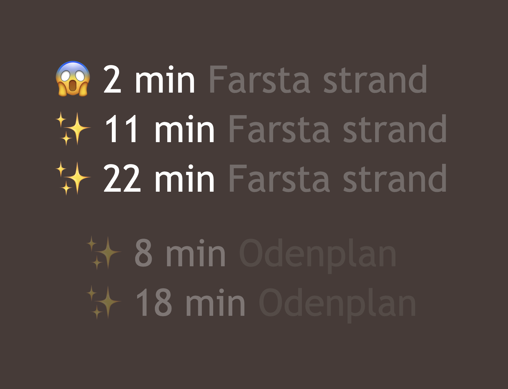

# Tinfo

"Tinfo" is a web server that fetches and renders upcoming departures. Currently,
only using Swedish kommunaltrafik providers for Stockholm (SL) and Gothenburg
(VT) are supported.



## Development

1. Set up an .env file based on the included example (only values relevant for
   the provider are required)

2. Export `PAGE_INFO` for desired provider from [config.ts](src/config.ts)

3. Start by executing `bun run dev`

Open http://localhost:8000/ (or whatever port is logged during startup) with
your browser to see the result.

## Docker

### Build

```sh
$ bun docker:build
```

### Start

```sh
$ bun run docker:start
```
